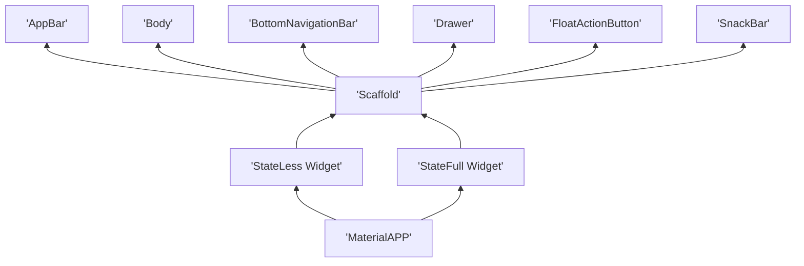

## Aula 27/01

Criamos usuários "2DevSESI" para nós podermos utilizar esse computador, configuramos a senha e configurações iniciais.

Instalamos VSCode, criamos Profiles Web e Flutter para facilitar a troca quando formos escrever outra linguagem de programação.
Depois, instalamos o Live Share que permite o Host compartilhar o terminal e arquivos, facilitando a visualização de toda a sala.

Posteriormente, fizemos a votação de representante.

Além disso, criamos nossa pasta, com o nome de 'LorenzoPM' e criei diretórios de todas as matérias do semestre, juntamente com um README.md
Instrução:
Para entrar em um diretório, utilize: 'cd (nome da pasta)'
'mkdir' para criar um diretório.
'new-item' para criar um arquivo.

Assim, criamos esse README.md somente pelo terminal.

## Aula 03/02

## Tipo de Desenvolvimento

- Nativo
    - Android:
        - SDK: Android
        - IDE: Android Studio
        - Linguagens: Kotlin e Java
        - Ambientes: Mac, Win, Linux

    - iOS:
        - SDK: Cocoa Touch
        - IDE: XCode
        - Linguagens: Swift / Objective -C
        - Ambientes: Mac

- Multiplataforma
    - React Native:
        - SDK: Node.JS
        - IDE: VSCode
        - Linguagens: JavaScrpi / TypeScript 
        - Ambientes: Mac, Win, Linux

    - Flutter:
        - SDK: Flutter SDK
        - IDE: VSCode, Android Studio
        - Linguagens: Dart
        - Ambientes: Mac, Win, Linux

## Aula 10/02

## Preparação do Ambiente de Desenvolvimento

### Instalação do FlutterSDK
- Download do arquivo ZIP na página flutter.dev
- Inclusão do flutter na pasta C:\src
- Inclusão do flutter/bin nas Variáveis de Ambiente
- Teste o flutter --version

### Instalação do AndroidSDK
- Download do Android SDK - Command Line Tools
- Adicionar o Command-line ao C:\src\AndroidSDK
- Adicionar o SDKManager as Variáveis de Ambiente
- Download dos pacotes
    - emulador
    - platforms
    - platform-tools
    - build-tools
- Adicionar ADB e o Emulator as Varáveis de Ambiente
- Criação da Imagem do Emulador - via sdkmanager
- Build do Emulador - via sdkmanager

### Criação de Projetos e Códigos da Linha de Comando

- Criação de projetos:
    - flutter create nome_do_app
        - Flags:
            - --empty : Cria um aplicativo "vazio"(hello World!)
            - --platforms : Permite a seleção de uma plataforma de desenvolvimento
                - ex: --platforms=android (A criação do projeto será somente para a plataforma android)
    - Exemplo de criação de um aplicativo andoroid vazio:
        - fluter create nome_do_app --empty --platforms=android
        - OBS: Nome do aplicativo: Todas as ltras minúsculas, separação de palavras com "_";
    - flutter doctor:
        - Permite correção de pequenos problenas no flutter e identificação dos parâmetros funionais em relação as plataformas de desenvolvimento
        - Sempre rodas o flutter docor no começo do desenvolvimento
    - flutter clean:
        - Limpa cache do build(apaga o apk interior)
    - flutter run -v
        - Build do app (apk)

- Gerenciamento de dependências do PubSpec()
    - Instalação
        - flutter pub add nome_dependencia
    - Baixar e Instalar dependências projetadas
        - flutter pub get
    - Outros comandos do Flutter (dependências)
        - flutter pub outdated (verifica se as dependências estão desatualizadas)
        - flutter pub upgrade (atualiza as dependências do flutter pub)

## Estrutura de um Aplicativo

#### A Hierarquia de Árvore

Gráfico com Demonstração da Hierarquia

